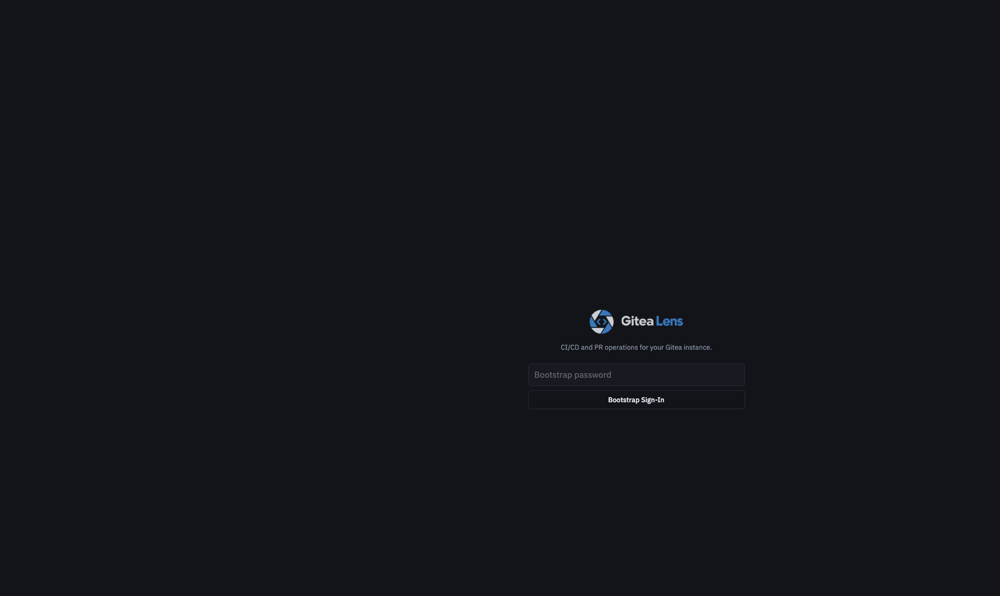
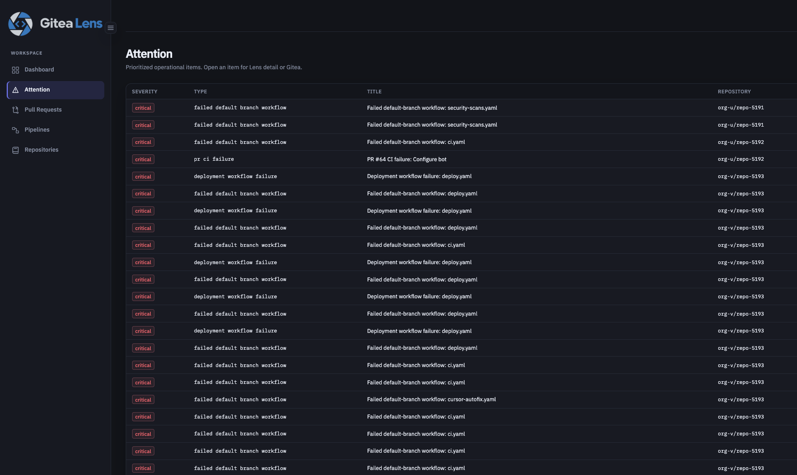
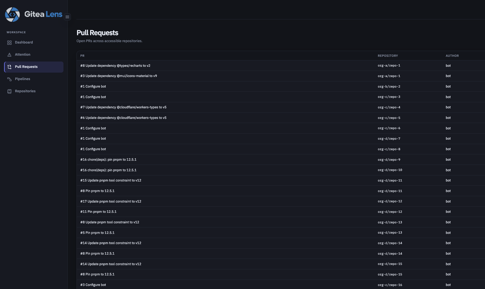
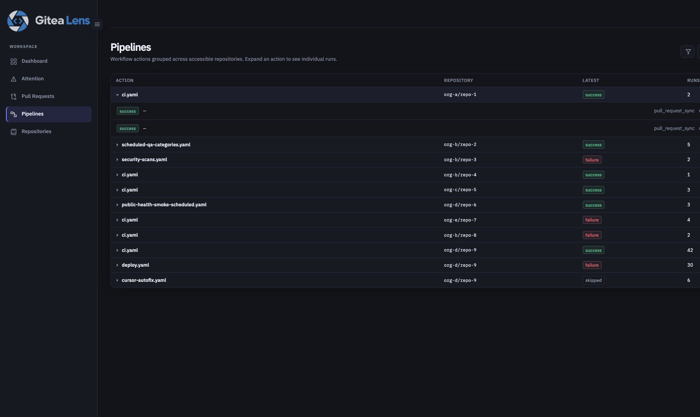
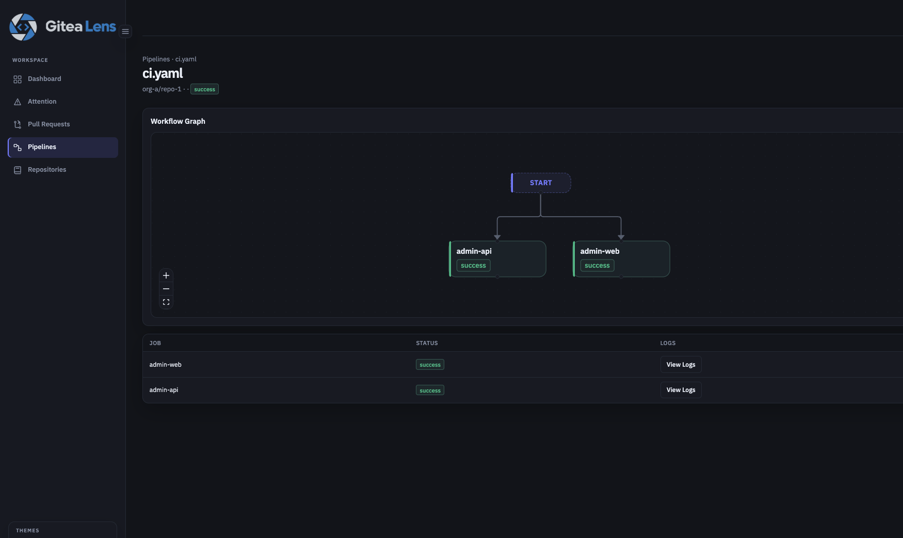
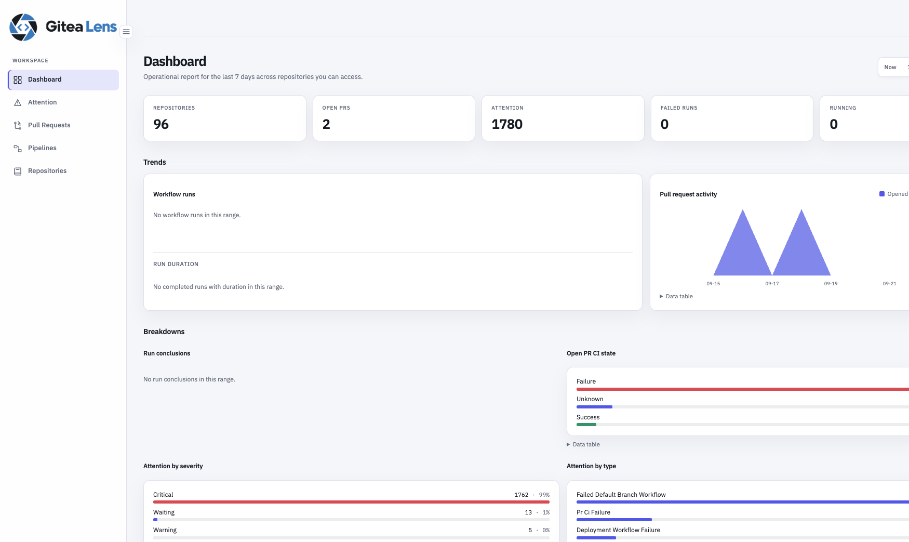
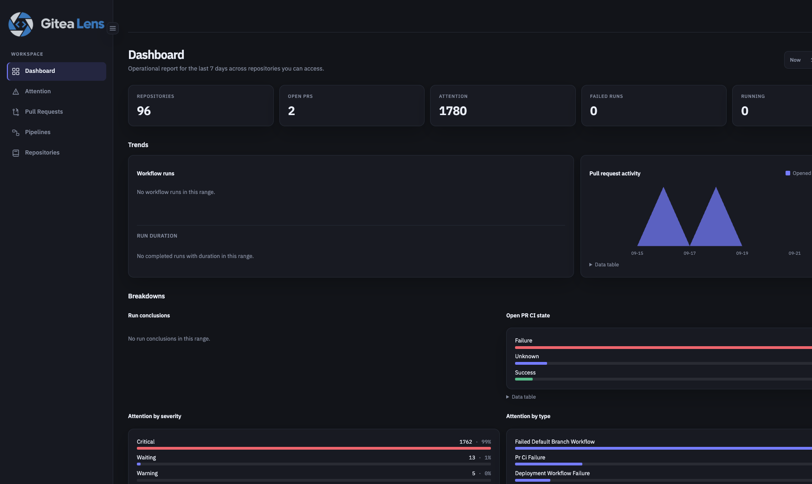
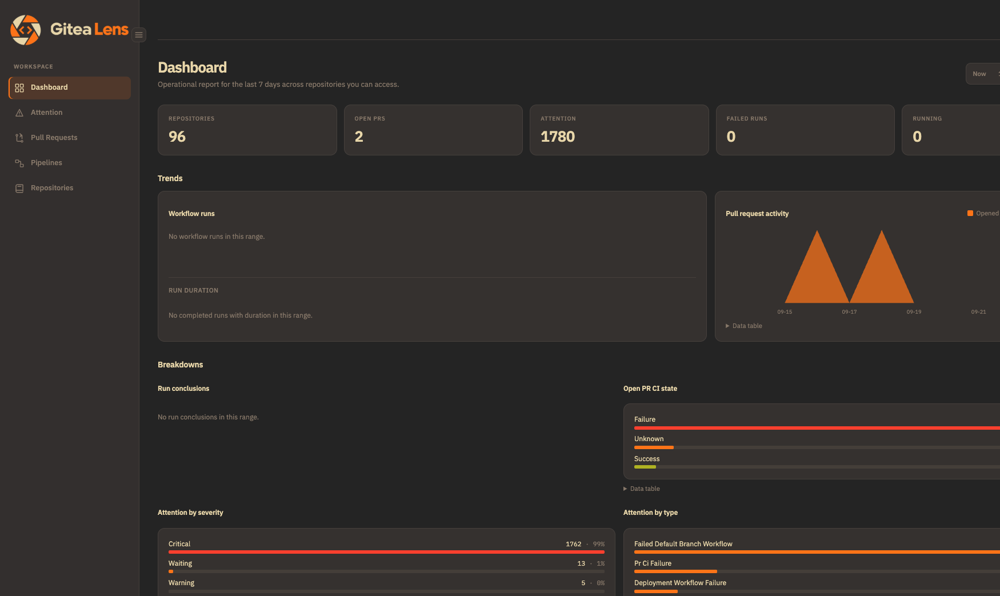
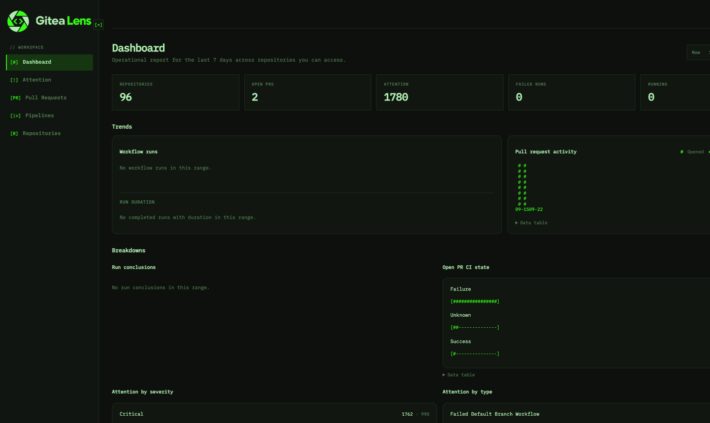

# Gitea Lens

Self-hosted CI/CD and pull-request operations console for Gitea.

Lens aggregates repositories, open pull requests, Gitea Actions runs, and attention items into one ops console so you can answer **what needs attention right now** without hopping repo to repo. Gitea stays the system of record; Lens syncs via API + webhooks and authenticates through Gitea OAuth (PKCE) or an optional bootstrap password.

Built and maintained by **[ncdLabs](https://ncdlabs.com)**.

**Docs:** [docs/](docs/README.md) · **Wiki:** [github.com/ncdlabs/gitea-lens/wiki](https://github.com/ncdlabs/gitea-lens/wiki) · **Spec:** [docs/prd-spec.md](docs/prd-spec.md)


---

## Screenshots

Repo names, authors, and local account labels in these shots are substituted (`org-a/repo-1`, `bot`, `admin`) so the UI is readable without exposing real inventory.

**Login**



**Attention** — prioritized CI failures, review waits, and related operational items.



**Pull Requests** — open PRs across accessible repositories, with CI state.



**Pipelines** — workflow actions grouped by repository; expand a group for individual runs.



**Pipeline Detail** — workflow graph, jobs, and on-demand logs.



### Dashboard Themes

Lens ships five theme options. System follows the OS preference (shown here resolving to dark).

| Light | Dark |
|-------|------|
|  |  |

| Gruvbox | Terminal |
|---------|----------|
|  |  |

**System** (OS preference)


---

## Features

- **Dashboard** — time-scoped summary and trends (Now / 1 / 7 / 30 / 90 days)
- **Attention** — discrete rules for CI failures, review waits, long-running runs, merge conflicts, and more
- **Repositories, pull requests, pipelines** — ACL-scoped lists with live SSE updates; on-demand job logs
- **Setup wizard** — Connect → Validate → Finish (webhook + OAuth app helpers)
- **Settings** — runtime preferences and Gitea integration (DB-backed secrets are write-only)
- **Gitea UI hooks** — optional `install-ui` links from Gitea nav / repo tabs
- **Ops** — Prometheus `/metrics` (session-auth), retention purge, SQLite by default (Postgres experimental)

---

## Prerequisites

| Component | Version |
|-----------|---------|
| Go | 1.26+ (see `go.mod`) |
| Node.js | 22+ |
| Gitea | ~1.25+ (Actions APIs preferred; features degrade when missing) |
| Compose (installer default) | Podman Compose or Docker Compose |

---

## Quick start

### Install with Agent

Paste this prompt into your coding agent (Cursor, Codex, Claude Code, etc.). Fill in the bracketed values first, or leave them blank and let the agent ask.

```text
Install Gitea Lens from https://github.com/ncdlabs/gitea-lens on this machine.

Goals:
1. Clone the repo if needed, then run the guided installer (./scripts/install.sh or make install). Prefer Compose via Podman (`podman compose`); fall back to Docker Compose or `--method binary` if Compose is unavailable.
2. Collect or confirm: Gitea base URL, Gitea API token (repo/PR/Actions read), Lens public URL (server.external_url), and a bootstrap admin password. OAuth client id/secret are optional — the in-app Setup wizard can create or paste them later.
3. Write gitignored `.env` + `config.yaml` (or use install.yaml + `--non-interactive`). Set LENS_WEBHOOK_SECRET whenever Gitea URL is set (required at startup). Use LENS_GITEA_ALLOW_PRIVATE_NETWORK=true only for private/lab Gitea URLs.
4. Start Lens, open the printed URL (default http://127.0.0.1:8090), complete /setup if shown (Connect → Validate → Finish), sign in, and click Sync now.
5. Report the App URL, how to stop/restart, bootstrap vs OAuth login, and any remaining manual steps (Gitea system webhook, OAuth redirect URI, optional `lens install-ui`).

Constraints:
- Do not commit secrets, .env, config.yaml, or install.yaml.
- Prefer .yaml over .yml for new config files.
- Follow docs/install.md and README.md; do not invent Redis, WebSockets, or multi-forge setup.
- Ask before destructive changes or removing existing services.

My values (replace or leave blank to prompt me):
- Gitea URL: [https://git.example.com]
- Gitea token: [paste or point to a secret]
- Lens public URL: [http://127.0.0.1:8090]
- Bootstrap password: [generate a strong one if blank]
- Install method: [compose | binary]
- Private/lab Gitea network: [yes | no]
```

### Guided installer (recommended)

You need a Gitea URL and API token. OAuth can be created in the setup wizard or beforehand.

```bash
./scripts/install.sh
# or: make install
```

Non-interactive:

```bash
cp install.example.yaml install.yaml   # fill in secrets
./scripts/install.sh --config install.yaml --non-interactive
```

The installer writes gitignored `.env` + `config.yaml`, checks dependencies, then starts Lens (Compose by default; `--method binary` optional).

Open the printed URL (default **http://127.0.0.1:8090**). If setup is incomplete, the **Setup** wizard walks Connect → Validate → Finish. After the first admin login, use **Sync now** so repositories exist before other users refresh access.

### Local development

```bash
make deps
npm run start          # API :8090 + Vite :5173; prints URLs + bootstrap creds
# npm run stop | npm run restart
make test
```

Default bootstrap user/password when unset: `bootstrap` / `lens-local` (prefer `config.yaml` over `config.example.yaml`; override with `LENS_CONFIG`).

Production-shaped binary:

```bash
make frontend && make build-go
./bin/lens serve --config config.yaml
```

### Manual Compose

```bash
export LENS_GITEA_URL='https://git.example.com'
export LENS_GITEA_TOKEN='your-gitea-api-token'
export LENS_WEBHOOK_SECRET='replace-me'          # required when URL is set
export LENS_SERVER_EXTERNAL_URL='http://127.0.0.1:8090'
export LENS_AUTH_OAUTH_CLIENT_ID='your-oauth-client-id'
export LENS_AUTH_BOOTSTRAP_PASSWORD='change-me'  # optional first-run / lab
# export LENS_GITEA_ALLOW_PRIVATE_NETWORK=true   # private/lab Gitea URLs

podman compose -f compose.yaml up --build
```

### Optional: Gitea UI links

```bash
./bin/lens install-ui --custom-path /var/lib/gitea/custom --lens-url https://lens.example.com
# remove: ./bin/lens uninstall-ui --custom-path /var/lib/gitea/custom
```

More detail: [docs/install.md](docs/install.md) · [docs/getting-started.md](docs/getting-started.md).

---

## Configuration

Defaults live in `config.example.yaml`. Environment overrides use the `LENS_*` prefix — see [docs/configuration.md](docs/configuration.md).

Important:

- Set `server.external_url` to the public URL (including subpath). Lens strips only that configured prefix — not client `X-Forwarded-Prefix`.
- When `gitea.url` is set, `LENS_WEBHOOK_SECRET` is required unless `LENS_WEBHOOK_ALLOW_UNSIGNED=true` (lab only).
- OAuth redirect: `{external_url}/api/v1/auth/callback`. Prefer a public Gitea OAuth client (PKCE).
- Optional `LENS_ENCRYPTION_KEY` (min 16 chars) encrypts OAuth tokens at rest.

Runtime settings and Gitea integration can also be managed in the UI (`/settings`) after bootstrap login.

---

## Documentation

| Resource | Contents |
|----------|----------|
| [docs/](docs/README.md) | Architecture, features, API, auth, deploy, operations |
| [docs/install.md](docs/install.md) | Installer modes, proxy, webhooks, backup |
| [docs/prd-spec.md](docs/prd-spec.md) | Product requirements |
| [docs/implementation-plan.md](docs/implementation-plan.md) | Implementation direction |
| [CONTRIBUTING.md](CONTRIBUTING.md) | Dev workflow and guidelines |
| [Wiki](https://github.com/ncdlabs/gitea-lens/wiki) | Same guides (publish after first wiki page exists) |

---

## How to contribute

1. Fork and branch.
2. `make deps && make test && npm run start`
3. Keep forge types in `internal/forge/gitea`; enforce authz server-side.
4. Open a PR with a short summary and test notes.

See [CONTRIBUTING.md](CONTRIBUTING.md) and [docs/development.md](docs/development.md).

---

## Attribution

**Gitea Lens** is an [ncdLabs](https://ncdlabs.com) open-source project.

Gitea® is a trademark of its respective owners. This project is not affiliated with or endorsed by the Gitea project.

## License

Apache-2.0 — see [LICENSE](LICENSE).
